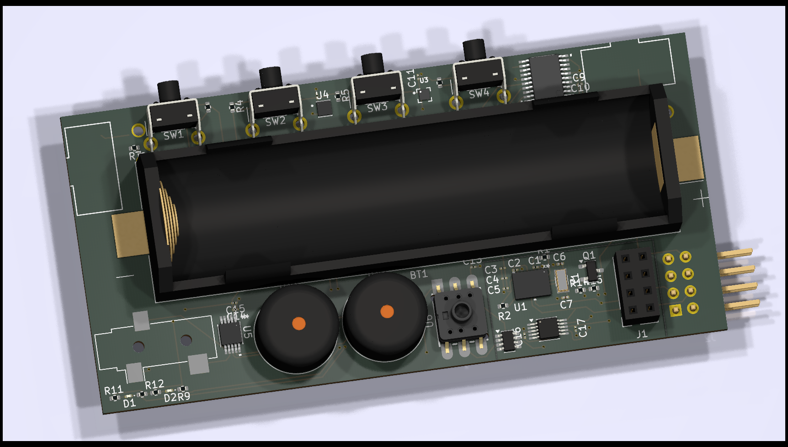
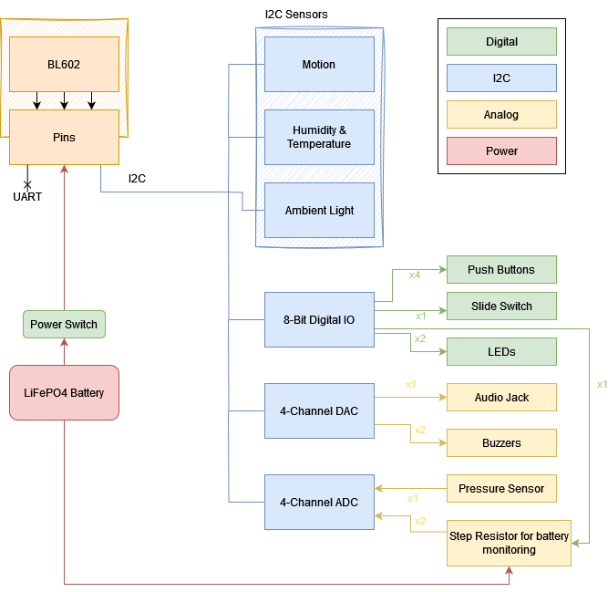
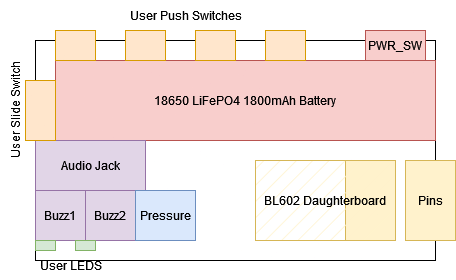

# Peanut - Pinenut-01S BL602 MotherBoard

The Peanut is a motherboard for the [PINE64 Pinenut Model-01S](https://pine64.com/product/pinenut-model01s-wifi-ble5-module/) BL602 Wifi/BLE5 Module.

It aims to offer a very large suite of sensors, including Motion, Humidity, Temperature, Ambient Light, and Pressure. While also providing some LEDs and buttons for interaction, with audio output and buzzers for the classic electronic bleeps. It's entirely powered by a single LiFePO4 battery, allowing for easy charging and a compact size.

A prime design point is to also provide capability for extensions; such as solar charging, motor powering, or literally anything else you can imagine.

> [!WARNING]
> This is a hobby project and our first exploration into creating a custom PCB from scratch. Mistakes are Guarenteed!

## Roadmap

- [x] Board Design & Specs
- [ ] Component sourcing
- [ ] Electronic Schematics
- [ ] Breadboard + Devkit prototyping
- [ ] Prototype PCB with contact pads
- [ ] Refinements and Debugging
	- Continual Refinements until design works!
- [ ] Rev 1.0 board
- [ ] Case and Extensions

## Components

> [!NOTE]
> Component list is subject to change; especially before Rev 1.0

[Take a look at the up-to-date table](https://github.com/WYVERN2742/Peanut/issues/3)

## Electronic Schematics:

- [x] Motion Sensor
- [x] Humidity Sensor
- [x] Temperature Sensor
- [x] Ambient Light Sensor
- [x] Digital Muxer
	- [x] Push Buttons
	- [x] Switch
	- [x] LEDs
- [ ] DAC
	- [ ] Audio Jack
	- [ ] Piezo
- [ ] ADC
	- [ ] Pressure Sensor
	- [ ] Battery Monitor

## Design Goals

*User goals and considerations; along with some misc ideas/wants*
- Include Battery + Interfaces for Extension (data & power)
- Small in size;- strap to wrist.
- As many general sensors as possible
- Buttons on battery-side of board if space is constrained
- Buttons should be ergonomic (if mounted length-ways, buttons facing away) 

